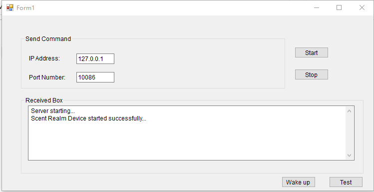

# 气味 PPT

## 项目说明

气味 PPT，通过气味王国脖戴设备在 PPT 演示时播放指定的气味；

## 运行环境

软件环境：Windows 10 + .NET 4.5

硬件：脖戴式气味播放器 + 信号发射器

## 使用说明

1. 将 source 下 `scentppt.zip` 拷贝到 `c:\data` 目录，解压；
2. 运行目录下的 `scentrealm.exe` 程序；
3. 点击 `Start` 按钮，显示 `Scent Realm Device connection success.`，表示运行成功；
4. 点击唤醒 `Wake up`；
5. 在 PPT 中插入指令，指定播放某一路气味 `C:\data\ScentRealm\ScentRealmClient\ScentRealmClient.exe ${channelID} ${time}；`

<aside>
💡 channelID 气味通道号   time 播放时长（单位 秒）

</aside>

## 注意事项

1. 需要信号发射器；
2. 脖带式设备长时间不用，再次使用前请确保电量和开机状态；
3. 一定要唤醒设备；
4. 如果需要自定义目录，注意与PPT中指令一致即可；
